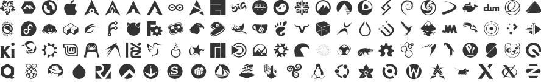
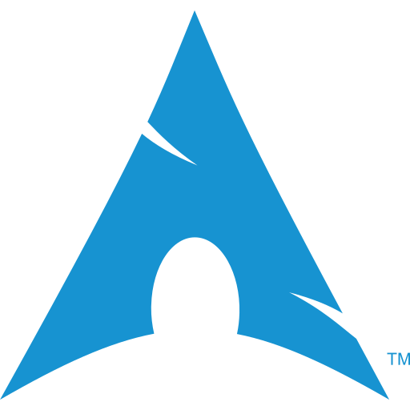
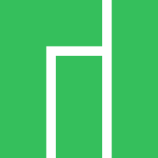
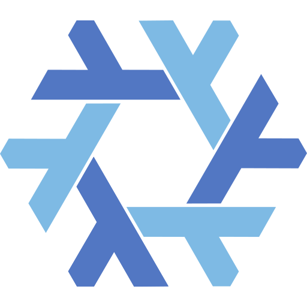
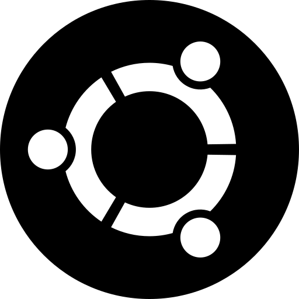

# font-logos #

font-logos is an icon font containing logos of popular linux distributions and other open source software.

*Note:* All brand icons are trademarks of their respective owners and should only be used to represent the company or product to which they refer.

## Installation ##

Install the font by downloading and unpacking the latest release's zip manually or installing it from npm:

	npm install font-logos

To use the font, include `assets/font-logos.css` as well as the
fonts in your project and use the CSS classes listed below.

	<link href="/assets/font-logos.css" rel="stylesheet">

Alternatively just link to it using a CDN such as [jsDelivr](//jsdelivr.com):

	<link href="//cdn.jsdelivr.net/npm/font-logos@1/assets/font-logos.css" rel="stylesheet">

## Usage ##

Include an icon using the corresponding CSS class in an empty element:

	<i class="fl-[icon]"></i>

Add `fl-fw` as class for a fixed width icon.

If you want to insert a glyph of this font on a GNU/Linux system press `Ctrl + Shift + u`, release the keys and then type the code point, for instance: `Ctrl + Shift + u` and `f31a` will insert the `Tux` glyph.

Available logos are:

|       Distribution        |       CSS class        |                  Code                  | Code point |                        Image                         |
| ------------------------- | ---------------------- | -------------------------------------- | :--------: | :--------------------------------------------------: |
| Alma Linux                | `fl-almalinux`         | `<i class="fl-almalinux"></i>`         |  `0xf31d`  |          |
| Alpine                    | `fl-alpine`            | `<i class="fl-alpine"></i>`            |  `0xf300`  |             |
| AOSC OS                   | `fl-aosc`              | `<i class="fl-aosc"></i>`              |  `0xf301`  |               |
| Apple                     | `fl-apple`             | `<i class="fl-apple"></i>`             |  `0xf302`  |              |
| Archcraft *               | `fl-archcraft`         | `<i class="fl-archcraft"></i>`         |  `0xf345`  |          |
| ArchLabs                  | `fl-archlabs`          | `<i class="fl-archlabs"></i>`          |  `0xf31e`  |           |
| Arch Linux                | `fl-archlinux`         | `<i class="fl-archlinux"></i>`         |  `0xf303`  |          |
| ArcoLinux *               | `fl-arcolinux`         | `<i class="fl-arcolinux"></i>`         |  `0xf346`  |          |
| Arduino *                 | `fl-arduino`           | `<i class="fl-arduino"></i>`           |  `0xf34b`  |            |
| Artix Linux               | `fl-artix`             | `<i class="fl-artix"></i>`             |  `0xf31f`  |              |
| BigLinux *                | `fl-biglinux`          | `<i class="fl-biglinux"></i>`          |  `0xf347`  |           |
| Budgie                    | `fl-budgie`            | `<i class="fl-budgie"></i>`            |  `0xf320`  |             |
| CentOS                    | `fl-centos`            | `<i class="fl-centos"></i>`            |  `0xf304`  |             |
| Codeberg *                | `fl-codeberg`          | `<i class="fl-codeberg"></i>`          |  `0xf330`  |           |
| CoreOS                    | `fl-coreos`            | `<i class="fl-coreos"></i>`            |  `0xf305`  |             |
| Crystal Linux *           | `fl-crystal`           | `<i class="fl-crystal"></i>`           |  `0xf348`  |            |
| Debian                    | `fl-debian`            | `<i class="fl-debian"></i>`            |  `0xf306`  |             |
| Deepin                    | `fl-deepin`            | `<i class="fl-deepin"></i>`            |  `0xf321`  |             |
| Devuan                    | `fl-devuan`            | `<i class="fl-devuan"></i>`            |  `0xf307`  |             |
| Docker                    | `fl-docker`            | `<i class="fl-docker"></i>`            |  `0xf308`  |             |
| elementary OS             | `fl-elementary`        | `<i class="fl-elementary"></i>`        |  `0xf309`  |         |
| Endeavour OS              | `fl-endeavour`         | `<i class="fl-endeavour"></i>`         |  `0xf322`  |          |
| Fedora                    | `fl-fedora`            | `<i class="fl-fedora"></i>`            |  `0xf30a`  |             |
| Fedora (inverse)          | `fl-fedora-inverse`    | `<i class="fl-fedora-inverse"></i>`    |  `0xf30b`  |     |
| Ferris                    | `fl-ferris`            | `<i class="fl-ferris"></i>`            |  `0xf323`  |             |
| Flathub                   | `fl-flathub`           | `<i class="fl-flathub"></i>`           |  `0xf324`  |            |
| Forgejo *                 | `fl-forgejo`           | `<i class="fl-forgejo"></i>`           |  `0xf335`  |            |
| FreeBSD                   | `fl-freebsd`           | `<i class="fl-freebsd"></i>`           |  `0xf30c`  |            |
| FreeCAD *                 | `fl-freecad`           | `<i class="fl-freecad"></i>`           |  `0xf336`  |            |
| Garuda Linux *            | `fl-garuda`            | `<i class="fl-garuda"></i>`            |  `0xf337`  |             |
| Gentoo                    | `fl-gentoo`            | `<i class="fl-gentoo"></i>`            |  `0xf30d`  |             |
| GIMP *                    | `fl-gimp`              | `<i class="fl-gimp"></i>`              |  `0xf338`  |               |
| Gitea *                   | `fl-gitea`             | `<i class="fl-gitea"></i>`             |  `0xf339`  |              |
| GNU Guix                  | `fl-gnu-guix`          | `<i class="fl-gnu-guix"></i>`          |  `0xf325`  |           |
| Hyperbola GNU/Linux-libre*| `fl-hyperbola`         | `<i class="fl-hyperbola"></i>`         |  `0xf33a`  |          |
| illumos                   | `fl-illumos`           | `<i class="fl-illumos"></i>`           |  `0xf326`  |            |
| Inkscape *                | `fl-inkscape`          | `<i class="fl-inkscape"></i>`          |  `0xf33b`  |           |
| Kali Linux                | `fl-kali-linux`        | `<i class="fl-kali-linux"></i>`        |  `0xf327`  |         |
| KDE Neon *                | `fl-kde-neon`          | `<i class="fl-kde-neon"></i>`          |  `0xf331`  |           |
| KDE Plasma *              | `fl-kde-plasma`        | `<i class="fl-kde-plasma"></i>`        |  `0xf332`  |         |
| Kdenlive *                | `fl-kdenlive`          | `<i class="fl-kdenlive"></i>`          |  `0xf33c`  |           |
| KiCad *                   | `fl-kicad`             | `<i class="fl-kicad"></i>`             |  `0xf34c`  |              |
| Krita *                   | `fl-krita`             | `<i class="fl-krita"></i>`             |  `0xf33d`  |              |
| Kubuntu *                 | `fl-kubuntu`           | `<i class="fl-kubuntu"></i>`           |  `0xf333`  |            |
| Kubuntu (inverse) *       | `fl-kubuntu-inverse`   | `<i class="fl-kubuntu-inverse"></i>`   |  `0xf334`  |    |
| Linux Mint                | `fl-linuxmint`         | `<i class="fl-linuxmint"></i>`         |  `0xf30e`  |          |
| Linux Mint (inverse)      | `fl-linuxmint-inverse` | `<i class="fl-linuxmint-inverse"></i>` |  `0xf30f`  |  |
| Loc-OS *                  | `fl-locos`             | `<i class="fl-locos"></i>`             |  `0xf349`  |              |
| LXLE Linux *              | `fl-lxle`              | `<i class="fl-lxle"></i>`              |  `0xf33e`  |               |
| Mageia                    | `fl-mageia`            | `<i class="fl-mageia"></i>`            |  `0xf310`  |             |
| Mandriva                  | `fl-mandriva`          | `<i class="fl-mandriva"></i>`          |  `0xf311`  |           |
| Manjaro                   | `fl-manjaro`           | `<i class="fl-manjaro"></i>`           |  `0xf312`  |            |
| MX Linux *                | `fl-mxlinux`           | `<i class="fl-mxlinux"></i>`           |  `0xf33f`  |            |
| NixOS                     | `fl-nixos`             | `<i class="fl-nixos"></i>`             |  `0xf313`  |              |
| Octoprint *               | `fl-octoprint`         | `<i class="fl-octoprint"></i>`         |  `0xf34d`  |          |
| OpenBSD                   | `fl-openbsd`           | `<i class="fl-openbsd"></i>`           |  `0xf328`  |            |
| OpenSCAD *                | `fl-openscad`          | `<i class="fl-openscad"></i>`          |  `0xf34e`  |           |
| OpenSUSE                  | `fl-opensuse`          | `<i class="fl-opensuse"></i>`          |  `0xf314`  |           |
| OSH *                     | `fl-osh`               | `<i class="fl-osh"></i>`               |  `0xf34f`  |                |
| OSHWA *                   | `fl-oshwa`             | `<i class="fl-oshwa"></i>`             |  `0xf350`  |              |
| Parabola GNU/Linux-libre *| `fl-parabola`          | `<i class="fl-parabola"></i>`          |  `0xf340`  |           |
| Parrot OS                 | `fl-parrot`            | `<i class="fl-parrot"></i>`            |  `0xf329`  |             |
| Pop!_OS                   | `fl-pop-os`            | `<i class="fl-pop-os"></i>`            |  `0xf32a`  |             |
| Prusa Slicer *            | `fl-prusaslicer`       | `<i class="fl-prusaslicer"></i>`       |  `0xf351`  |        |
| Puppy Linux *             | `fl-puppy`             | `<i class="fl-puppy"></i>`             |  `0xf341`  |              |
| QubesOS *                 | `fl-qubesos`           | `<i class="fl-qubesos"></i>`           |  `0xf342`  |            |
| Raspberry pi              | `fl-raspberry-pi`      | `<i class="fl-raspberry-pi"></i>`      |  `0xf315`  |       |
| Red Hat                   | `fl-redhat`            | `<i class="fl-redhat"></i>`            |  `0xf316`  |             |
| RepRap *                  | `fl-reprap`            | `<i class="fl-reprap"></i>`            |  `0xf352`  |             |
| RISC-V *                  | `fl-riscv`             | `<i class="fl-riscv"></i>`             |  `0xf353`  |              |
| Rocky Linux               | `fl-rocky-linux`       | `<i class="fl-rocky-linux"></i>`       |  `0xf32b`  |        |
| Sabayon                   | `fl-sabayon`           | `<i class="fl-sabayon"></i>`           |  `0xf317`  |            |
| Slackware                 | `fl-slackware`         | `<i class="fl-slackware"></i>`         |  `0xf318`  |          |
| Slackware (inverse)       | `fl-slackware-inverse` | `<i class="fl-slackware-inverse"></i>` |  `0xf319`  |  |
| Snappy                    | `fl-snappy`            | `<i class="fl-snappy"></i>`            |  `0xf32c`  |             |
| Solus                     | `fl-solus`             | `<i class="fl-solus"></i>`             |  `0xf32d`  |              |
| Tails *                   | `fl-tails`             | `<i class="fl-tails"></i>`             |  `0xf343`  |              |
| Trisquel GNU/Linux *      | `fl-trisquel`          | `<i class="fl-trisquel"></i>`          |  `0xf344`  |           |
| Tux                       | `fl-tux`               | `<i class="fl-tux"></i>`               |  `0xf31a`  |                |
| Ubuntu                    | `fl-ubuntu`            | `<i class="fl-ubuntu"></i>`            |  `0xf31b`  |             |
| Ubuntu (inverse)          | `fl-ubuntu-inverse`    | `<i class="fl-ubuntu-inverse"></i>`    |  `0xf31c`  |     |
| Void                      | `fl-void`              | `<i class="fl-void"></i>`              |  `0xf32e`  |               |
| XeroLinux *               | `fl-xerolinux`         | `<i class="fl-xerolinux"></i>`         |  `0xf34a`  |          |
| Zorin OS                  | `fl-zorin`             | `<i class="fl-zorin"></i>`             |  `0xf32f`  |              |

_* = will come with the next release_

## Building ##

Make sure you have the following dependencies installed:
* Node, Python and jq to run the build scripts
* [FontForge](//fontforge.org) to generate the fonts
* [wkhtmltopdf](http://wkhtmltopdf.org/) to generate this readme's preview image

Then run `npm install`/`yarn install` and `make`.
